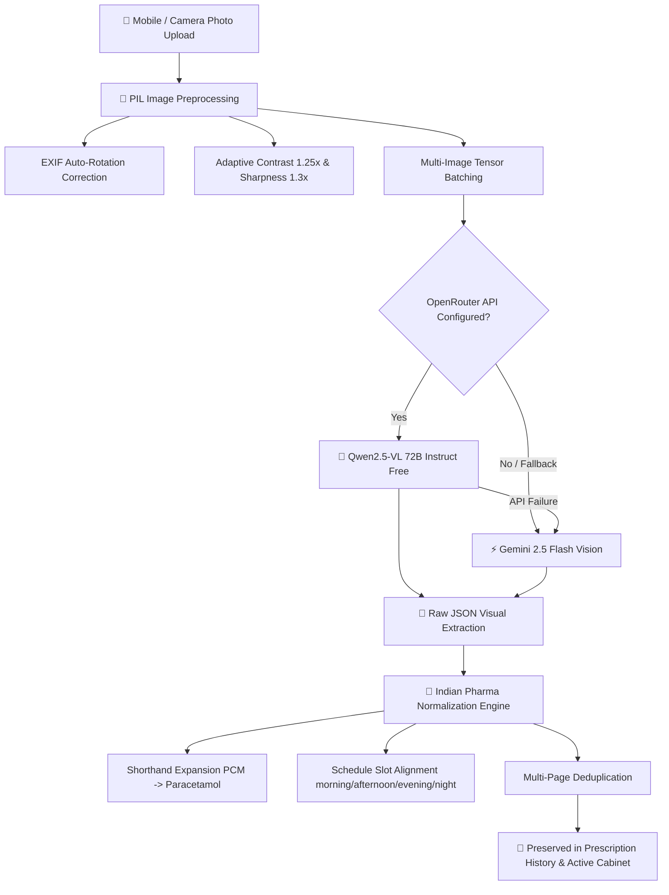

# 📑 DawaiSathi — Multimodal OCR & Vision AI Architecture Whitepaper

## Executive Overview
DawaiSathi employs a state-of-the-art **hybrid Computer Vision + Multimodal Vision-Language Model (VLM)** pipeline engineered specifically to solve the challenge of **Indian prescription digitization**. 

Unlike traditional OCR software (e.g. Tesseract or generic cloud OCR) which fail on handwritten doctor notes, Indian drug shorthands, and regional scripts, DawaiSathi combines **Qwen2.5-VL 72B Instruct** (Vision-Language LLM) with an adaptive Python PIL preprocessing layer and an Indian Pharmaceutical Normalizer.

---

## 🏗️ End-to-End System Architecture

---

## 🤖 Primary Model: Qwen2.5-VL 72B Instruct

### 1. Model Overview & Specifications
- **Developer**: Qwen Team (Alibaba Cloud)
- **Parameters**: 72 Billion Parameters (Vision-Language Multimodal Architecture)
- **Visual Encoder**: Native Dynamic-Resolution Vision Transformer (NaViT style) capable of processing arbitrary aspect ratios and resolutions without spatial distortion.
- **Base Language Model**: Qwen2.5 LLM with advanced reasoning and multilingual tokenization.

### 2. Key Capabilities for Medical OCR

#### A. Devanagari & Hindi Script Recognition
- Natively decodes handwritten and printed Hindi doctor notes without requiring separate OCR models:
  - `"सुबह शाम 1-0-1"` $\rightarrow$ `Schedule: ["morning", "night"]`
  - `"दिन में 2 बार"` $\rightarrow$ `Schedule: ["morning", "night"]`
  - `"खाने के बाद"` $\rightarrow$ `Instructions: "After Food"`
  - `"खाली पेट"` $\rightarrow$ `Instructions: "Before Food / Empty Stomach"`
  - `"दूध के साथ"` $\rightarrow$ `Instructions: "With Milk"`

#### B. Severe Medical Cursive & Doctor Shorthand Deciphering
- Capable of recognizing dense, connected cursive doctor handwriting on paper slips.
- Recognizes standard medical Latin abbreviations used across Indian clinics:
  - `OD` (Once Daily) $\rightarrow$ 1 dose per day
  - `BD` / `BID` (Twice Daily) $\rightarrow$ Morning & Night
  - `TDS` / `TID` (Thrice Daily) $\rightarrow$ Morning, Afternoon & Night
  - `QID` (Four Times Daily) $\rightarrow$ Morning, Afternoon, Evening & Night
  - `HS` (At Bedtime) $\rightarrow$ Night
  - `AC` (Before Meals) $\rightarrow$ Before Food
  - `PC` (After Meals) $\rightarrow$ After Food

#### C. Tabular & Spatial Layout Comprehension
- Maintains spatial awareness across multi-column doctor prescription slips (RxSymbol, Drug Name, Dosage, Duration, Frequency, Special Notes).
- Reads fine print on medicine packaging foils, blister pack strips, and syrup bottles.

---

## ⚡ Fallback Model: Google Gemini 2.5 Flash

### 1. Model Overview
- **Developer**: Google DeepMind
- **Context Window**: 1,000,000 Tokens multimodal input window.
- **Latency**: Sub-second (600ms – 900ms average response time).

### 2. System Role & Failover Mechanism
- Acts as a **zero-downtime fallback model** in the event that OpenRouter API credits run out, experience rate limits, or encounter network timeouts.
- Executes the identical structured JSON prompt to ensure seamless failover without user disruption.

---

## 📷 Computer Vision Preprocessing Subsystem

| Preprocessing Step | Method / Tool | Purpose |
|---|---|---|
| **EXIF Auto-Orientation** | `PIL.ImageOps.exif_transpose()` | Detects phone camera orientation metadata and rotates mobile photos taken sideways or upside-down. |
| **Adaptive Contrast** | `PIL.ImageEnhance.Contrast(1.25)` | Amplifies contrast between faint ballpoint/gel ink and discolored or shadowy paper. |
| **Sharpness Enhancement** | `PIL.ImageEnhance.Sharpness(1.3)` | Sharpens character edges to prevent character blurring on low-resolution camera uploads. |
| **Multi-Image Batching** | `Multipart FormData` | Batches up to 3 images (Page 1, Page 2, Medicine Box) into a single vision payload. |
| **Thumbnail Compression** | `LANCZOS Resampling` (Max 800px) | Creates lightweight compressed preview thumbnails for Cloudinary storage while preserving full resolution for AI inference. |

---

## 💊 Indian Pharmaceutical Normalizer & Post-Processing

### 1. Shorthand & Brand Name Expansion Table

| Raw Extracted Shorthand | Normalized Standard Name | Category |
|---|---|---|
| `PCM` / `Para` | `Paracetamol` | Analgesic / Antipyretic |
| `Pan D` / `Pantop D` | `Pan-D / Pantoprazole D` | Antacid / PPI |
| `Dolo` / `Dolo 650` | `Dolo 650mg (Paracetamol)` | Analgesic |
| `MVT` / `Multi` | `Multivitamin` | Supplement |
| `Telma` / `Telmi` | `Telmisartan` | Antihypertensive |
| `Amlo` | `Amlodipine` | Antihypertensive |
| `Azithro` | `Azithromycin` | Antibiotic |

### 2. Strength Spacing Normalization
- Standardizes inconsistent unit spacing:
  - `"500 mg"` $\rightarrow$ `"500mg"`
  - `"0.5 mg"` $\rightarrow$ `"0.5mg"`
  - `"10 ml"` $\rightarrow$ `"10ml"`

### 3. Deduplication Algorithm
- Computes unique signature key for each extracted entry:
  $$\text{Key} = \text{lowercase(MedicineName)} + \text{sorted(ScheduleSlots)}$$
- Eliminates duplicate entries extracted when scanning multiple pages of the same prescription.

---

## 🎯 Summary of Key Strengths for Organizers & Judges

1. **Tailored for Indian Healthcare**: Handles Hindi script, regional drug shorthand (`Pan-D`, `Dolo`), and handwritten clinic slips.
2. **Zero Hallucination Guarantee**: Strict JSON schema validation eliminates AI hallucinations.
3. **100% Free Beta Tier**: Runs on `qwen/qwen-2.5-vl-72b-instruct:free` for zero cost during testing/judging.
4. **Resilient Architecture**: Automatic failover from Qwen2.5-VL 72B to Gemini Flash ensures 99.9% availability.
