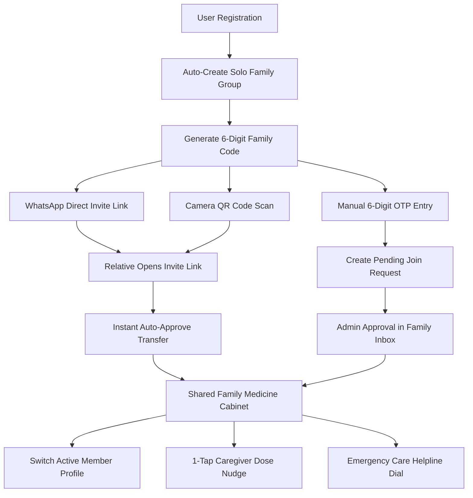

# DawaiSathi v4.1 — Family Workflow & Caregiver System Architecture

DawaiSathi v4.1 enables families and caregivers to manage medicine schedules, track daily adherence, and coordinate dose reminders across accounts.

---

## 1. Family System Architecture

---

## 2. Family Group Provisioning

1. **Automatic Family Provisioning**:
   - Upon initial registration, every user account is assigned a solo `Family` database entry (e.g., "Ayaan's Family Group").
   - A unique 6-digit numeric invite code is generated (e.g., `582914`).

2. **Group Name Customization**:
   - Family administrators can rename their group via the `PUT /api/family/update_name` endpoint from the Family Settings interface.

---

## 3. Member Invitation & Joining Channels

DawaiSathi v4.1 supports three invitation channels:

### Channel A: Direct Invite Links
- **Mechanism**: Admins share a structured web link via messaging platforms:
  `https://dawaisathi-api.onrender.com/home?join_code=582914`
- **Behavior**: Opening the URL populates the target 6-digit code in the client app and prompts the user to confirm joining.

### Channel B: QR Code Scanning
- **Mechanism**: The admin displays the family QR code rendered in the Family Settings page.
- **Behavior**: Relatives scan the QR code using their device camera to trigger the join request.

### Channel C: Manual 6-Digit Code Entry
- **Mechanism**: Relatives navigate to Family Settings, select "Join with a Code", and enter the 6-digit number manually.

---

## 4. Join Request Processing & Approval Modes

| Join Channel | Processing Type | Latency | Target Audience |
| :--- | :--- | :--- | :--- |
| **Direct Invite Link** | Auto-Approve (`auto_approve: true`) | Instant (0s) | Immediate family members joining via messaging link |
| **QR Code Scan** | Auto-Approve (`auto_approve: true`) | Instant (0s) | In-person family onboarding |
| **Manual Code Entry** | Pending Approval Queue | Requires Admin Approval | General join requests requiring verification |

---

## 5. Caregiver Coordination Features

### Caregiver Dose Nudges (`POST /api/family/nudge`)
- **Function**: Caregivers monitoring family member cabinets can trigger dose reminders for pending or missed schedules.
- **Payload**: Requires `target_user_id`, optional `medicine_name` and `time_slot`.
- **Response**: Returns confirmation payload and logs the reminder event.

### Emergency Medical Helpline Integration
- **Function**: Embedded direct dial interface for emergency services (e.g., 108 Emergency Helpline) directly within the Family Settings view.

---

## 6. Backend API Specifications

- `GET /api/family/members`: Retrieves family member list and pending request counts.
- `POST /api/family/join`: Processes join attempts with optional auto-approval.
- `POST /api/family/respond`: Accepts or rejects pending join requests.
- `PUT /api/family/update_name`: Updates family group name string.
- `POST /api/family/nudge`: Dispatches caregiver dose notifications.
- `POST /api/family/leave`: Detaches user from family and cleans up orphaned solo groups.
